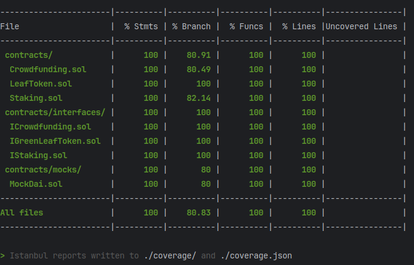

# EcoGreenFund

[Visitez le site EcoGreenFund](https://egf-frontend.vercel.app/)

EcoGreenFund is a decentralized application (dApp) that enables users to fund environmental projects and earn rewards through staking mechanisms. The platform uses smart contracts to manage crowdfunding campaigns, staking pools, and token rewards. Users can create projects, contribute to campaigns, and stake tokens to earn rewards. The LeafToken (LEAF) is used for rewards and project funding, while the MockDai token is used for staking. The dApp is built with Solidity smart contracts, Hardhat development environment, and Next.js frontend framework.

## Smart Contracts

### LeafToken Contract
- ERC20 standard token "LeafToken" (LEAF) used for rewards and project funding.
- Initial Supply: A predefined amount of tokens minted at contract creation.

### Crowdfunding Contract
- Users can create and fund environmental projects.
- Campaign management features for creators.
- ReentrancyGuard inherited for security against reentrancy attacks.
- Contributors can receive LeafToken rewards.

### Staking Contract
- Users stake mockDai tokens to earn rewards over 1, 3, or 6 months.
- Reward reinvestment and direct claim options available.

### MockDai Contract
- Simplified Dai stablecoin for development.
- Functions to buy mock Dai with Ether and sell it back.
- Owner functions to mint and burn tokens.

## Testing and Network Information

- Crowdfunding Contract tests cover deployment, campaign management, contributions, withdrawals, and reward claims.
- LeafToken deployment ensures correct initial settings.
- MockDai Contract tests the buying and selling of tokens, as well as owner-specific minting and burning.
- Staking Contract tests cover the staking process, reward calculations, and claim functions.

## Local Development with Hardhat

- Local Hardhat node for Ethereum environment simulation.
- Contracts are compiled and deployed locally, with addresses outputted to the console.
- The `scripts/deploy.js` script runs deployment processes and simulates user actions.

## Deployment on Sepolia Testnet

- Configured for Sepolia with Alchemy URL and private keys.
- Solidity optimizer enabled for efficient contract execution.
- Contract verification with Etherscan API after deployment.

## Backend Technologies

- Solidity: Programming language for Ethereum smart contracts.
- Hardhat: Ethereum development environment.
- Ethers.js: Library for interacting with Ethereum blockchain and smart contracts.
- Mocha/Chai: Testing framework and assertion library for smart contract testing.

## Frontend Technologies

- Next.js: React framework with server-side rendering and static site generation.
- Chakra UI: UI library for building responsive and elegant user interfaces.
- RainbowKit: Wallet connectivity toolkit for integrating Ethereum wallets into the dApp.
- Wagmi and Viem: Libraries for smart contract interaction.

